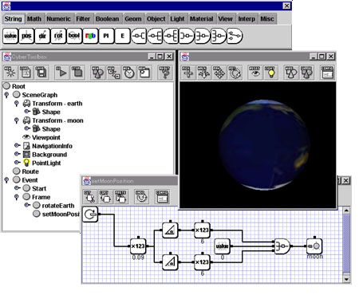
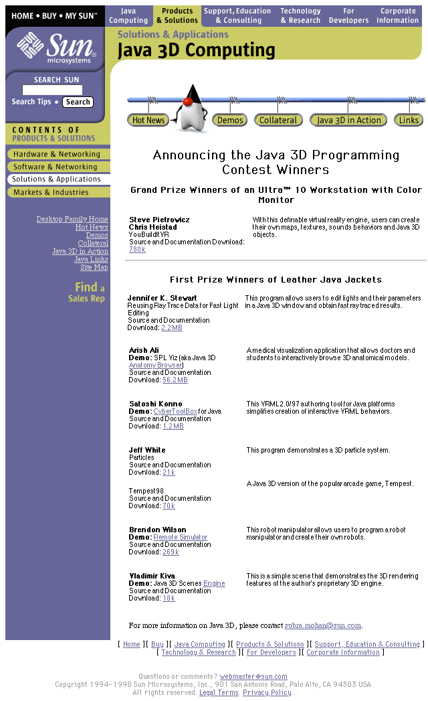

# CyberToolbox for Java

CyberToolbox for Java is a VRML2.0/97 authoring tool for Java platforms. VRML is the most standard 3D file format on the World Wide Web now. However, It is difficult to create good interactive behaviors for beginner creators who have not been studied computer programming languages, because the creators have to use some programming languages, Java or Java Script, to create the behaviors in VR world. CyberToolbox has a visual programming language so that the creators can create the interactive behaviors easily. Using CyberToolbox, the creators can create the behaviors only to connect between icon modules by data-flow lines.

## Repository

- [CyberToolbox for Java User's Guide v2.0](doc/ctb200usersguide.pdf)

## Awards

The CyberToolbox is a Java version of CyberToolboxForWin32 using Java3D, and it is a first prize winning entry in the Java 3D programming contest which was held from March to July 1998 :-)

